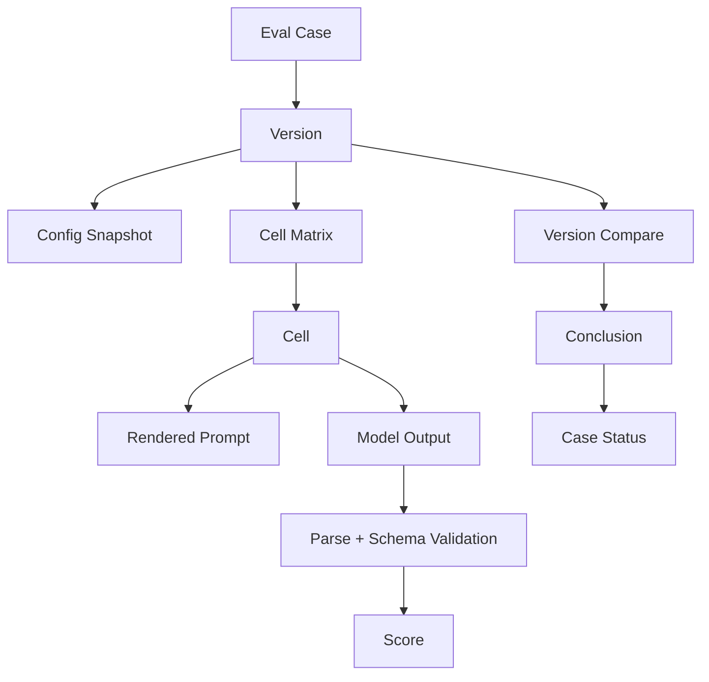
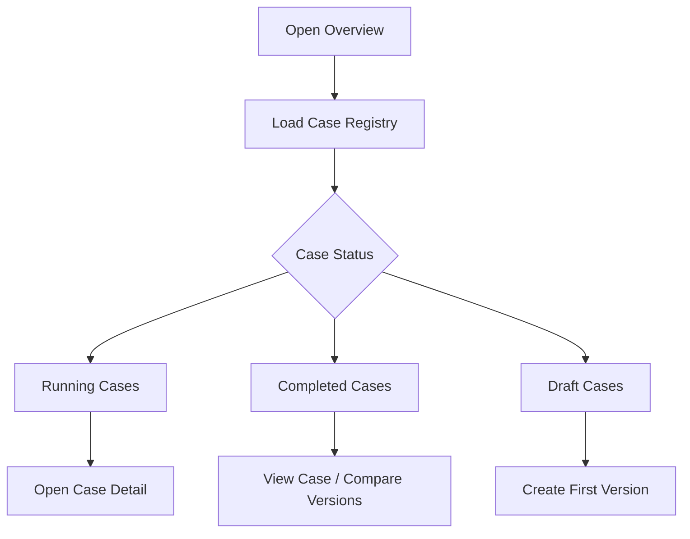
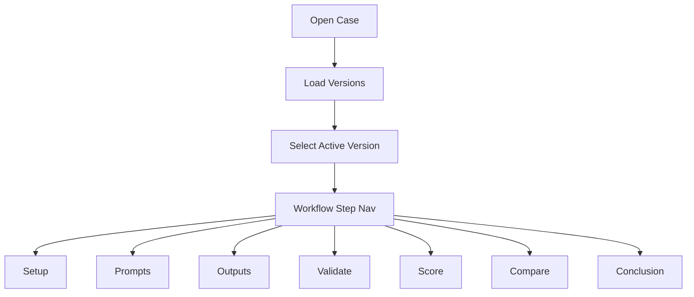
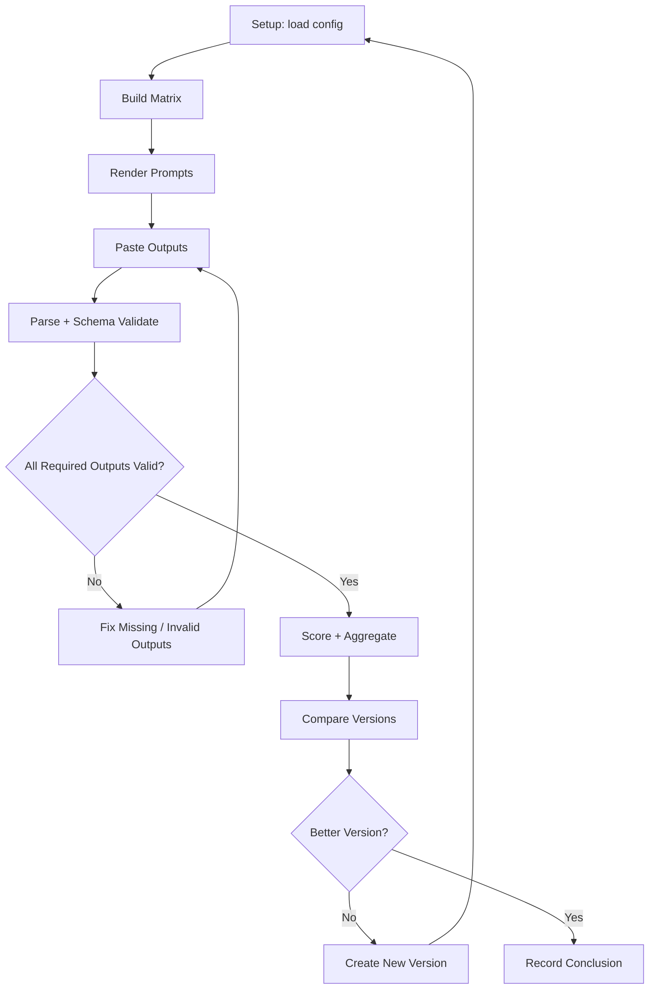
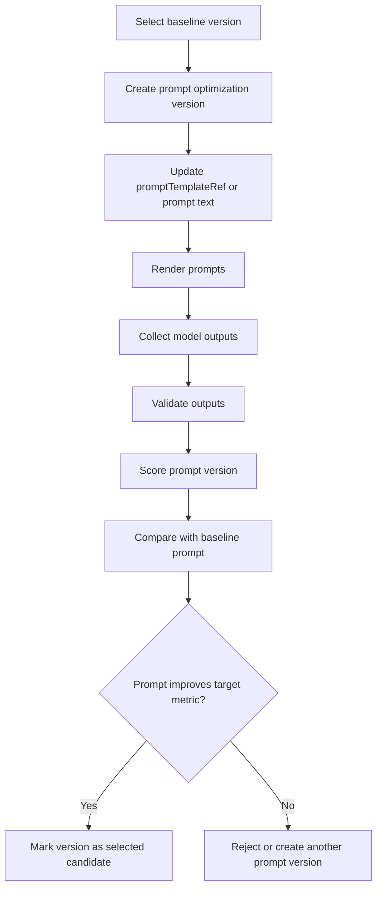
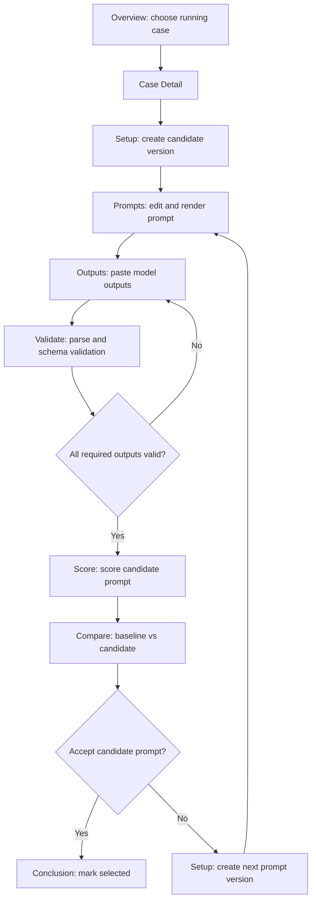
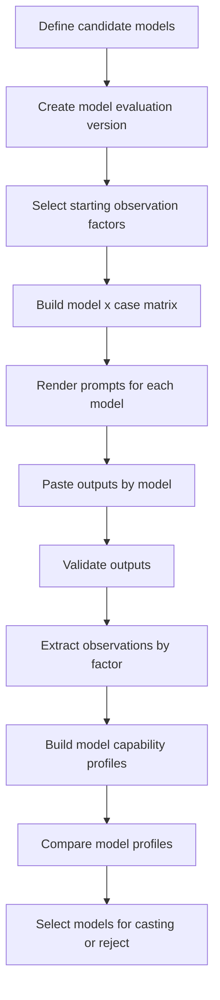
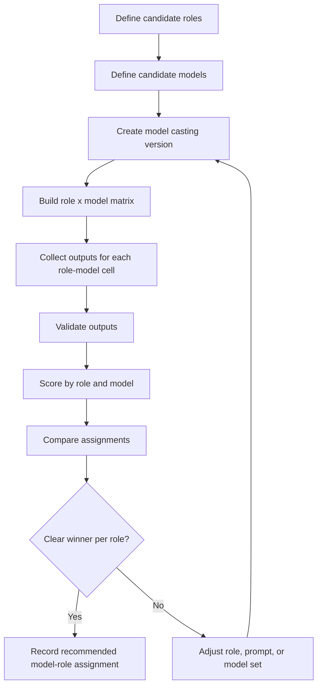
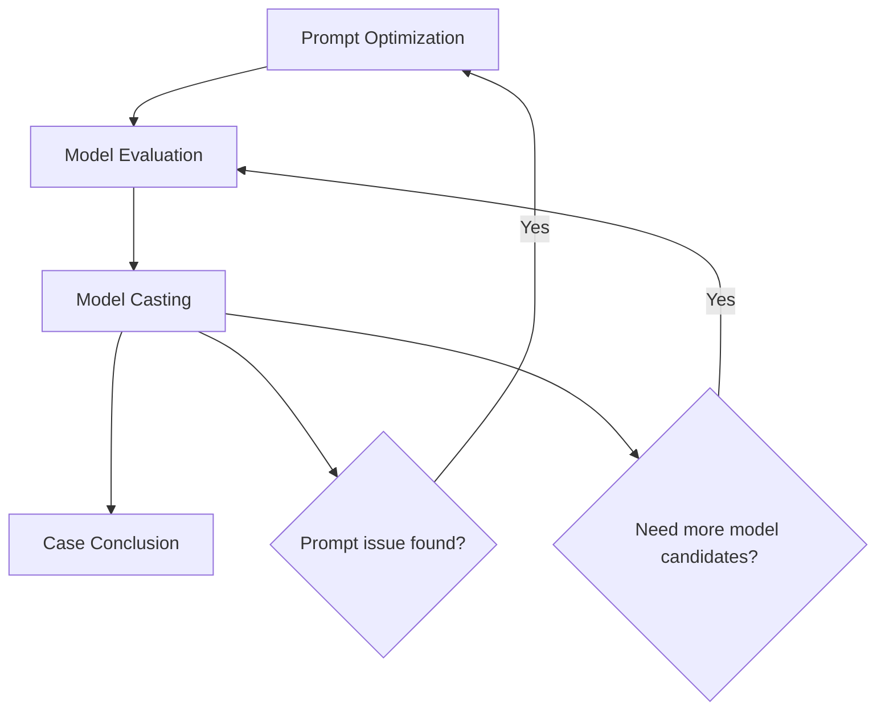

# Eval Web Workflow

## 1. 定位

Eval Web 是本地 playground，用于组织和比较 eval case 的实验过程。

它不是模型执行平台，也不是正式 review artifact 的写入者。第一版只服务本地开发者，帮助用户看清：

- 当前有哪些 case 正在跑。
- 每个 case 跑到了哪个阶段。
- 一个 case 下有哪些版本。
- 每个版本的 prompt、模型输出、校验、评分和结论是什么。
- 哪个版本被选为当前 case 的更优方案。

## 2. 核心对象

### Eval Case

一个 case 是完整评测单元，不是单个 model cell。

示例：

```text
change-assurance-casting
plugin-lifecycle
event-reporting
```

case 承载：

- case id / name
- 当前状态
- active version
- selected version
- 当前 workflow stage
- 最近更新时间
- 最终结论，如果已完成

### Version

version 是 case 下的一次完整实验版本。

创建新 version 的原因包括：

- 优化 prompt。
- 添加或移除模型对比。
- 调整 role 定义。
- 选择更好的 reviewer role。
- 调整 scorer / schema。
- 调整 case 输入或期望。

原则：

- 已进入输出收集或评分阶段的 version 不应被静默改写。
- prompt、model set、role set、scorer 发生语义变化时，应创建新 version。
- 一个 case 可以有多个历史 version，但最多只有一个 selected version。

### Workflow Stage

每个 version 都有独立 workflow stage 状态。

第一版固定阶段：

```text
Setup
→ Prompts
→ Outputs
→ Validate
→ Score
→ Compare
→ Conclusion
```

stage 状态：

```text
not_started
ready
in_progress
blocked
completed
```

### Cell

cell 是某个 version 展开后的最小运行单元。

维度：

```text
case × role × prompt × model × attempt
```

cell 只在 Case Detail 的具体 stage 页面中出现，不作为 Overview 页的主体。

### Result

result 是用户为某个 cell 粘贴的模型输出及其解析状态。

第一版 result 来源：

- 用户粘贴文本。
- UI 做 parse / schema validation。
- 不自动调用真实模型。

### Score

score 是对 result 的半自动汇总和人工确认结果。

第一版不追求完整自动裁决，只需要支持：

- schema valid / invalid / parse error 汇总。
- by model / by role / by prompt / by version 聚合。
- 人工确认某个 version 是否更好。

### Conclusion

conclusion 是一个 case 下某个 version 的最终判断。

可能状态：

```text
accepted
rejected
needs_rerun
archived
```

completed case 必须有 selected version 和 conclusion。

## 3. 信息架构

### Overview

Overview 是 Home 页。

它展示 case，不展示 cell matrix。

页面目标：

```text
回答“现在有哪些 case 在跑、跑到哪一步、哪些已经完成、下一步该处理哪个 case”。
```

推荐布局：

```text
Top summary
Running cases
Completed cases
Draft / not started cases
```

#### Top Summary

展示全局概况：

- total cases
- running cases
- completed cases
- blocked cases
- latest updated case

#### Running Cases

每行一个 case。

字段：

- case id / name
- active version
- current stage
- stage status
- progress summary，例如 `outputs 2/4`、`valid 1/4`、`scored 0/4`
- blockers / errors
- updated at

主动作：

- Open case

#### Completed Cases

每行一个 case。

字段：

- case id / name
- selected version
- conclusion
- winning role / prompt / model 摘要，如果存在
- completed at
- report / summary artifact

主动作：

- View case
- Compare versions

#### Draft Cases

尚未形成可运行 version 的 case。

字段：

- case id / name
- missing setup
- next action

## 4. Case Detail

Case Detail 是下钻后的工作区。

URL 语义：

```text
/cases/:caseId
```

页面结构：

```text
Case header
Version selector
Workflow step nav
Step content
```

### Case Header

展示：

- case id / name
- case status
- active version
- selected version
- current stage
- artifact root
- latest conclusion

### Version Selector

展示该 case 下所有 version。

字段：

- version id，例如 `v1`、`v2`
- version label，例如 `baseline`、`prompt-tightening`、`add-models`
- status
- created at
- short change note

动作：

- switch version
- create new version
- mark selected version

### Workflow Step Nav

固定步骤：

```text
Setup | Prompts | Outputs | Validate | Score | Compare | Conclusion
```

step nav 展示每个 stage 的状态，而不是只作为普通 tab。

## 5. Step 页面职责

### Setup

目标：确认该 version 的输入和展开维度。

展示：

- config path
- output dir / artifact root
- artifact health
- dimensions
- cases / roles / prompts / models / attempts 摘要
- generated cells count

动作：

- load dry-run artifacts
- refresh artifact state

第一版不要求从 UI 触发真实模型执行。

### Prompts

目标：查看和复制每个 cell 的 prompt。

展示：

- cell list
- rendered prompt，如果存在
- promptTemplateRef，如果 prompt renderer 尚未生成 prompt
- command preview
- model id / provider / settingRef

动作：

- copy prompt
- copy command preview
- mark prompt copied / ready

### Outputs

目标：收集模型输出。

展示：

- cell queue
- output status：missing / pasted
- 粘贴文本框
- last updated

动作：

- paste output
- save draft output
- clear draft output

第一版输出保存可以是本地 draft 状态；正式 artifact 写入规则后续由 Harness 设计。

### Validate

目标：对已粘贴输出做 parse 和 schema validation。

展示：

- parse status
- schema status
- normalized preview
- validation errors
- invalid cell list

动作：

- validate selected cell
- validate all pasted cells

状态：

```text
missing
pasted
parse_error
schema_invalid
valid
```

### Score

目标：半自动汇总和人工确认评分。

展示：

- by model summary
- by role summary
- by prompt summary
- by cell score detail
- unknown / invalid / failed count

动作：

- apply automatic summary
- edit manual score
- mark score reviewed

第一版 score 可以先是 summary，不必做复杂裁决。

### Compare

目标：比较同一个 case 下不同 version 的效果。

展示：

- version list
- changed dimensions：prompt / role / model / scorer / schema
- score delta
- validation delta
- selected version candidate

动作：

- choose candidate version
- open version detail

### Conclusion

目标：记录 case 的最终判断。

展示：

- selected version
- why selected
- remaining risks
- next action

动作：

- mark accepted
- mark rejected
- mark needs rerun
- archive version

## 6. 页面布局原则

- Overview 以 case table 为主，不展示 cell matrix。
- Case Detail 中 matrix 是 step 内局部视图。
- 不在一个页面同时塞 setup、matrix、prompt、output、summary。
- 先让用户知道 case 状态，再让用户进入某个 version 和 stage。
- 运行中 case 的下一步动作必须明显。
- completed case 的 selected version 和 conclusion 必须明显。
- UI 不能暗示已经执行真实模型，除非 artifact 中明确记录 executed。
- settingRef 始终作为 opaque value 展示，不读取本地 Claude setting JSON。

## 7. 底层 API 组件

Eval Web 的页面不直接拼接文件细节，而是通过一组本地 API 组件组织 workflow。

### Case Registry

管理 case 列表和 case-level 状态。

职责：

- 列出 running / completed / draft cases。
- 维护 active version。
- 维护 selected version。
- 维护 case current stage。
- 维护 case 更新时间和 conclusion 摘要。

### Version Manager

管理一个 case 下的 version。

职责：

- 创建 version。
- 从已有 version 复制新 version。
- 标记 version selected / archived。
- 冻结已进入输出收集或评分阶段的 version。
- 记录 version change note。

### Config Loader

读取并校验 eval config。

职责：

- 读取 config path。
- 校验 cases / roles / prompts / models / attempts。
- 生成 config snapshot。
- 报告缺失或不一致的配置项。

### Matrix Builder

展开 version 的 cell matrix。

职责：

- 展开 `case × role × prompt × model × attempt`。
- 生成 cell id。
- 计算 dimensions。
- 生成 matrix artifact view。

### Prompt Renderer

渲染每个 cell 的 prompt。

职责：

- 读取 promptTemplateRef。
- 注入 case / role / model / attempt 上下文。
- 生成 prompt.md。
- 在 renderer 尚未执行时，返回 promptTemplateRef placeholder。

### Command Preview

生成模型执行命令预览。

职责：

- 基于 cell 生成 command preview。
- 展示 provider / model id / settingRef / prompt path。
- 不执行真实模型。
- 不读取 Claude setting JSON。

### Output Intake

接收用户粘贴的模型输出。

职责：

- 保存 pasted draft。
- 维护 cell output 状态。
- 支持清空或替换 draft。
- 不把 draft 自动标记为 passed evidence。

### Output Parser / Validator

解析和校验输出。

职责：

- 支持 JSON / JSONL parse。
- 做 schema validation。
- 生成 normalized preview。
- 生成 validation errors。

### Scorer

对 valid output 做半自动评分和聚合。

职责：

- 生成 by model / by role / by prompt / by version 汇总。
- 标记 unknown / invalid / failed。
- 支持人工修正或确认。

### Comparator

比较同一 case 下的多个 version。

职责：

- 展示 version 间的 prompt / role / model / scorer / schema 差异。
- 展示 score delta。
- 展示 validation delta。
- 辅助选择 candidate version。

### Conclusion Manager

记录 case 结论。

职责：

- 设置 selected version。
- 记录 why selected。
- 记录 remaining risks。
- 标记 accepted / rejected / needs_rerun / archived。

### Artifact Store

统一管理 `.harness-eval/` 下的 artifact 和 draft 状态。

职责：

- 读取 dry-run artifacts。
- 读取 / 写入 UI draft 状态。
- 区分 draft 状态和正式 Harness artifact。
- 防止 UI 绕过 Harness 写正式 review artifact。

## 8. API 组件关系



## 9. 主要场景

第一版需要覆盖这些场景：

1. 查看所有 case 的状态。
2. 打开 running case。
3. 打开 completed case。
4. 为 draft case 创建第一个 version。
5. 为已有 case 创建新 version。
6. 加载或刷新 version 的 dry-run artifacts。
7. 查看展开后的 cells。
8. 查看或复制 cell prompt。
9. 粘贴 cell output。
10. 校验 pasted output。
11. 查看 validation errors。
12. 查看 score summary。
13. 比较同 case 下多个 version。
14. 选择 selected version。
15. 记录 conclusion。

## 10. Overview 流程



## 11. Case Detail 流程



## 12. Version 执行流程



## 13. 工作流模板

不同 eval 工作流共享同一套底层阶段，但它们的固定变量、变化变量和对比方式不同。

第一版需要明确支持三类工作流：

```text
prompt_optimization
model_evaluation
model_casting
```

通用原则：

- 每个 workflow 都发生在一个 case 下。
- 每次有语义变化时创建新 version。
- 一个 version 应尽量只承载一种主要变化，避免同时改 prompt、model set、role 和 scorer。
- Compare 阶段必须说明本次 version 相对 baseline 变化了什么。
- Conclusion 阶段必须记录是否接受该 version，以及原因。

### Prompt 优化

目标：在固定 case、role、model set 和 scorer 的前提下，比较不同 prompt 版本的效果。

适用场景：

- baseline prompt 找不到关键问题。
- prompt 输出格式不稳定。
- prompt 产生过多 false positive。
- prompt 的 evidence discipline 不足。
- prompt 需要强化某类 review 行为。

固定变量：

- case 输入。
- role 定义。
- model set。
- attempts。
- scorer / schema。

变化变量：

- promptTemplateRef。
- prompt text。
- prompt version label。
- prompt change note。

输出：

- 新 version。
- prompt diff / change note。
- 新旧 prompt 的 validation / score / conclusion 对比。
- 是否将新 prompt version 标记为 selected。

流程：



页面重点：

- Prompts step 展示 prompt diff 和 rendered prompt。
- Score step 按 case / role / model 展示新旧 prompt 差异。
- Compare step 重点展示目标指标是否改善。
- Conclusion step 记录接受或拒绝该 prompt change 的原因。

#### Prompt 优化：页面与场景

Prompt 优化 workflow 的核心问题不是“哪个模型最好”，而是：

```text
在相同 case、role、model set、attempts、scorer 下，新 prompt 是否比 baseline prompt 更好。
```

因此页面必须持续暴露 baseline version 和 candidate version 的关系。

##### 场景 PO-1：创建 prompt optimization version

入口：

- Overview 的 running case。
- Case Detail 的 Version selector。
- Compare / Conclusion 中选择继续迭代 prompt。

页面内容：

```text
Case Detail
  Case header
  Version selector
  Baseline version summary
  Create version action

Setup step
  workflowType = prompt_optimization
  baseVersion
  candidateVersion label
  prompt change note
  fixed dimensions preview
```

操作行为：

- 选择 baseline version。
- 创建 candidate version。
- 填写 version label。
- 填写 prompt change note。
- 确认固定变量没有变化。

流转节点：

```text
case opened
→ baseline selected
→ candidate version created
→ setup ready
```

调用关系：

```text
Case Registry
→ Version Manager.createFromBaseline
→ Config Loader.loadSnapshot
→ Matrix Builder.previewFixedDimensions
→ Artifact Store.createVersionDraft
```

##### 场景 PO-2：编辑或选择 prompt

入口：

- candidate version 的 Prompts step。

页面内容：

```text
Prompts step
  baseline promptTemplateRef
  candidate promptTemplateRef
  prompt diff
  rendered prompt preview
  affected cells
  command preview
```

操作行为：

- 修改 candidate promptTemplateRef。
- 或粘贴 / 编辑 candidate prompt text。
- 查看 prompt diff。
- 渲染 prompts。
- 复制单个 cell prompt。

流转节点：

```text
setup ready
→ prompt changed
→ prompts rendered
→ prompts ready
```

调用关系：

```text
Version Manager.updatePromptRef
→ Prompt Renderer.renderVersion
→ Matrix Builder.getCells
→ Command Preview.buildForCells
→ Artifact Store.saveRenderedPrompts
```

##### 场景 PO-3：收集 candidate outputs

入口：

- candidate version 的 Outputs step。

页面内容：

```text
Outputs step
  cell queue
  model grouping
  prompt version label
  missing / pasted count
  selected cell prompt shortcut
  pasted output draft
```

操作行为：

- 选择 cell。
- 粘贴模型输出。
- 保存 draft。
- 清空 draft。
- 标记该 cell output 已收集。

流转节点：

```text
prompts ready
→ output missing
→ output pasted
→ all required outputs pasted
```

调用关系：

```text
Matrix Builder.getCells
→ Output Intake.saveDraft
→ Artifact Store.saveOutputDraft
→ Case Registry.updateProgress
```

##### 场景 PO-4：校验 pasted outputs

入口：

- candidate version 的 Validate step。
- Outputs step 中粘贴后立即触发单 cell validation。

页面内容：

```text
Validate step
  validation summary
  cell validation table
  parse errors
  schema errors
  normalized preview
  invalid cell queue
```

操作行为：

- validate selected cell。
- validate all pasted cells。
- 打开 invalid cell。
- 回到 Outputs step 修正输出。

流转节点：

```text
outputs pasted
→ parse validation
→ schema validation
→ valid outputs ready
```

异常流转：

```text
parse_error / schema_invalid
→ fix pasted output
→ validate again
```

调用关系：

```text
Output Intake.getDrafts
→ Output Parser / Validator.validate
→ Artifact Store.saveValidationDraft
→ Case Registry.updateProgress
```

##### 场景 PO-5：评分 candidate prompt

入口：

- candidate version 的 Score step。

页面内容：

```text
Score step
  candidate score summary
  by model score
  by role score
  by case finding coverage
  false positive / false negative indicators
  invalid / unknown cells
```

操作行为：

- 生成半自动 score summary。
- 查看某个 model / role 的 score detail。
- 对 score 做人工确认。
- 标记 score reviewed。

流转节点：

```text
valid outputs ready
→ score generated
→ score reviewed
```

调用关系：

```text
Output Parser / Validator.getValidOutputs
→ Scorer.scoreVersion
→ Artifact Store.saveScoreDraft
→ Case Registry.updateProgress
```

##### 场景 PO-6：比较 baseline 与 candidate prompt

入口：

- candidate version 的 Compare step。

页面内容：

```text
Compare step
  baseline version
  candidate version
  prompt diff
  score delta
  validation delta
  target metric delta
  regression notes
```

操作行为：

- 选择比较对象，默认 baseline。
- 查看新旧 prompt 差异。
- 查看新旧 score 差异。
- 标记 candidate 是否值得进入 conclusion。

流转节点：

```text
score reviewed
→ baseline compared
→ candidate accepted / rejected / needs iteration
```

调用关系：

```text
Version Manager.getBaselineAndCandidate
→ Comparator.comparePromptVersions
→ Scorer.getScoreDelta
→ Artifact Store.saveComparisonDraft
```

##### 场景 PO-7：记录 prompt optimization conclusion

入口：

- candidate version 的 Conclusion step。

页面内容：

```text
Conclusion step
  selected candidate
  accept / reject / needs_rerun
  why selected
  remaining risks
  next action
```

操作行为：

- 接受 candidate prompt。
- 拒绝 candidate prompt。
- 标记 needs_rerun。
- 创建下一轮 prompt optimization version。
- 将 candidate 标记为 selected version。

流转节点：

```text
candidate accepted
→ selected version updated
→ case completed or next workflow selected
```

或：

```text
candidate rejected
→ create next candidate version
→ setup ready
```

调用关系：

```text
Conclusion Manager.recordConclusion
→ Version Manager.markSelected / markRejected
→ Case Registry.updateCaseStatus
→ Artifact Store.saveConclusionDraft
```

#### Prompt 优化：页面流转图



#### Prompt 优化：页面内容矩阵

| 页面        | 主要内容                                                            | 关键操作                                        | 主要调用                                       |
| ----------- | ------------------------------------------------------------------- | ----------------------------------------------- | ---------------------------------------------- |
| Overview    | running case、current stage、active version、progress               | open case                                       | Case Registry                                  |
| Case Header | case status、active version、selected version、latest conclusion    | switch version                                  | Case Registry、Version Manager                 |
| Setup       | baseVersion、candidateVersion、fixed dimensions、prompt change note | create candidate version                        | Version Manager、Config Loader、Matrix Builder |
| Prompts     | prompt diff、rendered prompt、command preview、affected cells       | edit prompt、render、copy prompt                | Prompt Renderer、Command Preview               |
| Outputs     | cell queue、missing/pasted count、pasted draft                      | paste output、save draft、clear draft           | Output Intake、Artifact Store                  |
| Validate    | parse status、schema status、normalized preview、errors             | validate selected / all、fix invalid            | Output Parser / Validator                      |
| Score       | score summary、by model、by role、unknown/invalid count             | score version、review score                     | Scorer                                         |
| Compare     | baseline vs candidate、prompt diff、score delta、validation delta   | accept / reject candidate                       | Comparator、Scorer                             |
| Conclusion  | selected version、why selected、remaining risks、next action        | mark selected、needs_rerun、create next version | Conclusion Manager、Version Manager            |

### Model 评测

目标：建立模型作为 programming agent / code review agent 的初始能力画像。

Model 评测不是最终不可变评分表，也不只是选择一个 best model。它使用一组起始观察维度来判断模型是否适合作为编程 agent 底座模型，并为后续 `model_casting` 提供输入。

核心问题：

```text
这个模型是否适合作为编程 agent？
它强在哪里，弱在哪里？
它是否值得进入后续 role casting？
```

适用场景：

- 添加新模型候选。
- 淘汰低质量模型。
- 比较同一 role 下不同模型的输出稳定性。
- 判断某个模型是否适合进入后续 casting。
- 建立模型在编程任务中的初始能力 profile。
- 判断模型是否需要额外 guardrails。

起始观察维度：

```text
Reliability
Controllability
Agentic Execution
Engineering Judgment
Workflow Judgment
Operational Efficiency
```

这些维度用于指导 case 设计、结果解读和初始模型画像生成。后续可以根据实际 case、role casting 和工作流表现继续细化。

#### Reliability

可信度。

观察点：

- 是否伪造文件、命令、测试结果、artifact。
- 是否把 planned / suggested 说成 executed。
- 是否区分 observed / derived / hypothesis。
- 不确定时是否明确说不确定。
- 证据不足时是否拒绝下结论。

核心问题：

```text
这个模型说的话，能不能作为工程判断的输入？
```

#### Controllability

可控性。

观察点：

- 是否遵循 prompt / schema / 输出格式。
- 是否保持角色边界。
- 是否遵守“不调用模型”“只给命令”“不要改代码”等约束。
- 是否在关键假设缺失时先确认。
- 是否避免范围漂移。

核心问题：

```text
这个模型能不能被规则和上下文稳定约束？
```

#### Agentic Execution

Agent 执行力。

观察点：

- 是否会主动读取代码、diff、文档、配置。
- 是否会选择正确工具。
- 是否能根据失败结果调整行动。
- 是否能端到端完成任务。
- 是否能保持 artifact / workspace / git 边界。
- 是否避免无意义重跑和盲目尝试。

核心问题：

```text
这个模型能不能作为一个可靠的 coding agent 执行工作？
```

#### Engineering Judgment

工程判断。

观察点：

- 解法是否简单、局部、可维护。
- 是否符合 repo 既有架构边界。
- 是否理解 schema / workflow / artifact contract。
- 是否避免过度抽象。
- 是否补合适的测试。
- 是否能识别真实风险，而不是泛泛挑毛病。

核心问题：

```text
这个模型写出来或建议出来的东西，工程质量是否过关？
```

#### Workflow Judgment

工作流判断。

观察点：

- 是否知道什么时候继续、什么时候停下来确认。
- 是否能区分实现、验证、review、handoff。
- 是否能维护 version / case / score artifact 的边界。
- 是否能把失败归因到具体阶段。
- 是否能给出可继续执行的下一步。

核心问题：

```text
这个模型是否理解一个工程流程，而不是只会回答单个问题？
```

#### Operational Efficiency

运行效率。

观察点：

- 首次有效行动时间。
- 总耗时。
- token 消耗。
- 重试次数。
- 相同质量下的成本。
- 是否用更少步骤完成同等结果。
- token ROI，即单位 token 带来的有效工程收益。

核心问题：

```text
这个模型在真实工作中是否划算？
```

Operational Efficiency 不应只有一种口径。Model 评测需要支持两套标准：

```text
quality_first
cost_aware
```

#### Quality-first 标准

当不在乎 token 用量或成本时使用。

特点：

- token cost 不参与核心排名。
- 优先看 Reliability、Controllability、Agentic Execution、Engineering Judgment、Workflow Judgment。
- Operational Efficiency 只作为附加观察。
- 适合高风险 repo 工作、关键 review、复杂实现和需要高确定性的任务。

输出问题：

```text
不考虑 token 成本时，哪个模型最值得信任、最能完成任务？
```

#### Cost-aware 标准

当 token 用量、价格或响应速度重要时使用。

特点：

- token ROI 成为加权维度。
- 在质量达到最低阈值后，比较单位成本收益。
- 对高成本但质量提升有限的模型降权。
- 对低成本但需要大量重试的模型降权。

输出问题：

```text
在满足最低工程质量要求后，哪个模型的单位成本收益最高？
```

token ROI 的基本定义：

```text
token_roi = useful_engineering_outcome / token_cost
```

第一版不需要把它实现成唯一公式，可以先以 summary 方式呈现：

- output quality 是否达到最低阈值。
- completion 是否端到端成功。
- 是否减少人工修正。
- 是否减少 rerun。
- token 消耗和重试次数。
- 相同任务下相对其他模型的成本收益。

固定变量：

- case set 或 task set。
- task type，例如 review / planning / implementation / prompt optimization。
- prompt family。
- scorer / schema / observation rubric。

变化变量：

- model。
- model set。
- attempt count。
- provider / settingRef opaque value。

输出：

- model capability profile。
- 每个起始观察维度的 evidence-backed summary。
- valid rate / score / stability。
- latency / cost summary。
- quality_first ranking。
- cost_aware ranking。
- token ROI summary。
- 是否值得进入 `model_casting`。
- 需要的 guardrails。

流程：



页面重点：

- Setup step 明确 model set、task set、attempts 和起始观察维度。
- Outputs step 按 model 分组显示缺失输出。
- Validate step 显示各 model schema valid / invalid / parse error。
- Score step 按起始观察维度生成 model profile。
- Compare step 比较模型画像，而不是只比较 pass rate。
- Conclusion step 记录哪些模型进入 casting、哪些模型被淘汰、原因是什么。

### 模型选角

模型选角用于决定“哪个模型适合承担哪个 role”，不是简单地选一个全局最强模型。

目标：在一个 case 或一组 case 中，为不同 role 选择更合适的 model / prompt 组合。

适用场景：

- 同一模型在不同 role 上表现差异明显。
- 某个 role 需要更强的 evidence discipline。
- 某个 role 需要更低 false blocker rate。
- 需要选出 `reviewer role × model` 的推荐组合。
- 需要判断是否应拆分、合并或替换 role。

固定变量：

- case 输入。
- scorer / schema。
- role 候选定义集合，除非本次 workflow 目标就是 role 调整。

变化变量：

- role × model assignment。
- role prompt。
- candidate model set。
- selected role set。

输出：

- 每个 role 的 recommended model。
- 每个 role 的 recommended prompt version。
- 被淘汰的 model-role 组合及原因。
- 是否需要新 role 或 role 调整。
- case 的 selected version。

流程：



页面重点：

- Setup step 展示 role × model matrix。
- Prompts step 按 role 展示 prompt 差异。
- Score step 同时按 role 和 model 聚合。
- Compare step 展示每个 role 的 candidate ranking。
- Conclusion step 记录最终 model-role assignment，而不是只记录单个 winning model。

### 工作流选择关系

三类 workflow 可以串联，但不应混在同一个 version 中。

推荐顺序：



示例：

```text
v1 baseline
v2 prompt_optimization: tighten evidence rules
v3 model_evaluation: compare kimi / qwen / glm / deepseek with v2 prompt
v4 model_casting: choose model per role based on v3 candidate set
```

## 14. 页面与组件对应关系

```text
Overview
  Case Registry
  Version Manager
  Conclusion Manager

Setup
  Config Loader
  Matrix Builder
  Artifact Store

Prompts
  Prompt Renderer
  Command Preview
  Artifact Store

Outputs
  Output Intake
  Artifact Store

Validate
  Output Parser / Validator

Score
  Scorer

Compare
  Comparator
  Version Manager

Conclusion
  Conclusion Manager
  Case Registry
```

## 15. 第一版非目标

- 不做账号、权限、多用户协作。
- 不自动调用真实模型。
- 不读取 Claude setting JSON。
- 不回写 PR/MR。
- 不把 UI draft 状态当作正式 passed evidence。
- 不绕过 Harness 写正式 review artifact。

## 16. 第一版完成标准

第一版 Web Eval 可认为完成，当它能支持：

- Overview 展示 running / completed / draft cases。
- 用户可以从 case 下钻到 Case Detail。
- Case Detail 可以切换 version。
- Case Detail 按 workflow step 展示不同页面。
- Prompts step 能查看 prompt 或 promptTemplateRef。
- Outputs step 能粘贴 cell 输出。
- Validate step 能做 parse / schema validation。
- Score step 能展示半自动汇总。
- Conclusion step 能记录 selected version 和结论草稿。

其中所有正式 artifact 的写入边界仍以 Harness 设计为准。
